# Tiny GPU RTL-to-GDSII ASIC Implementation

  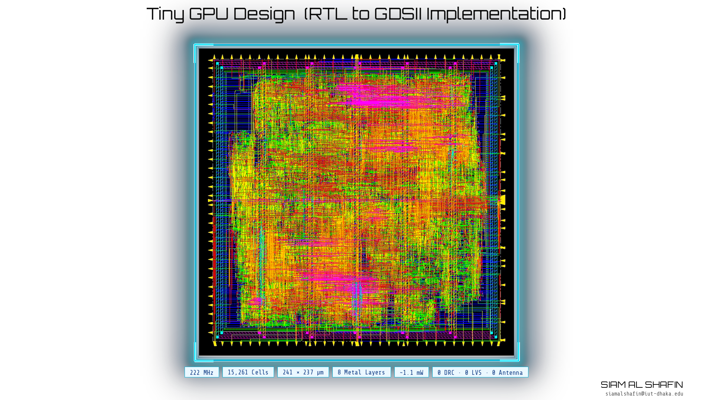

## Overview

This repository presents the complete RTL-to-GDSII implementation of a custom Tiny GPU using a commercial Cadence ASIC design flow. The project covers the full digital implementation process, beginning from RTL design and ending with signoff-clean GDSII generation.

The implementation includes logic synthesis, logical equivalence checking, floorplanning, power planning, placement, clock tree synthesis, routing, ECO timing optimization, static timing analysis, and physical verification.

## Design Summary

| Parameter                 | Value        |
| ------------------------- | ------------ |
| Target Frequency          | 222 MHz      |
| Clock Period              | 4.5 ns       |
| Standard Cells (Post-ECO) | 15,261       |
| Die Size                  | 241 × 237 µm |
| Die Area                  | ~0.057 mm²   |
| Setup WNS                 | +0.054 ns    |
| Hold WNS                  | +0.723 ns    |
| DRC Violations            | 0            |
| LVS Violations            | 0            |
| Antenna Violations        | 0            |

## ASIC Design Flow

### RTL Design

The Tiny GPU was developed in Verilog and consists of compute, memory, and control subsystems that were integrated and verified before synthesis.

### Logic Synthesis

Cadence Genus 21.18 was used to synthesize the RTL into a gate-level netlist while meeting a target clock period of 4.5 ns.

  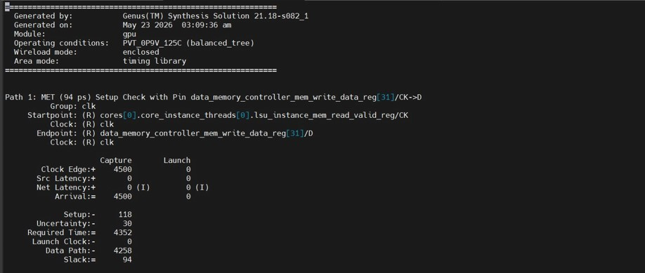

  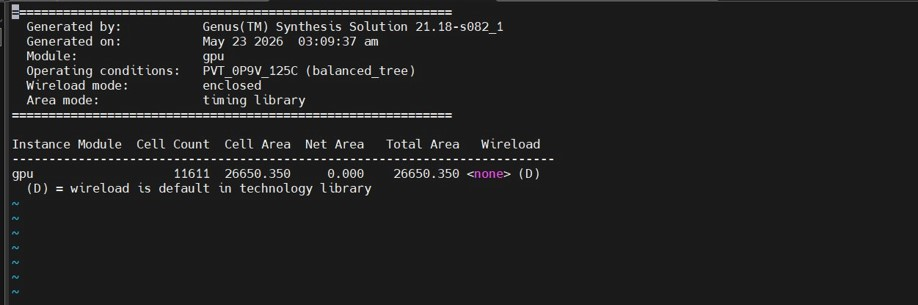

  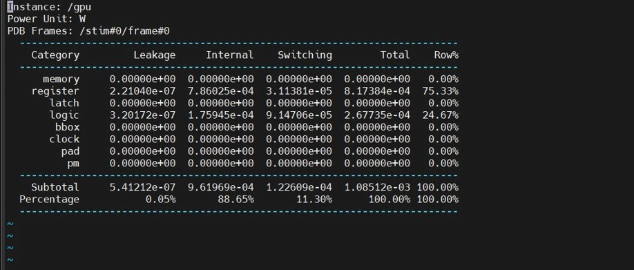

### Logical Equivalence Checking

Cadence Conformal LEC was used to verify equivalence between the RTL and synthesized netlist.

  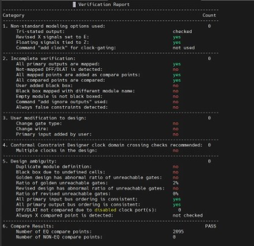

### Physical Design

Cadence Innovus was used for:

* Floorplanning
* Power Planning
* Placement Optimization
* Clock Tree Synthesis
* Detailed Routing
* ECO Timing Closure

### Static Timing Analysis

Cadence Tempus was used for final setup and hold signoff analysis.

### Physical Verification

Cadence Pegasus was used to perform DRC, LVS, connectivity, and antenna verification.

## Physical Implementation

### Floorplan and Power Grid

  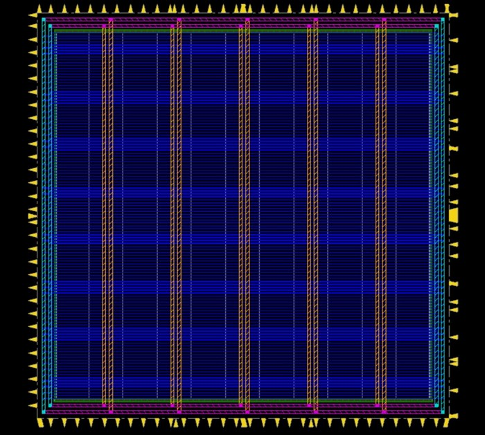

### Placement

  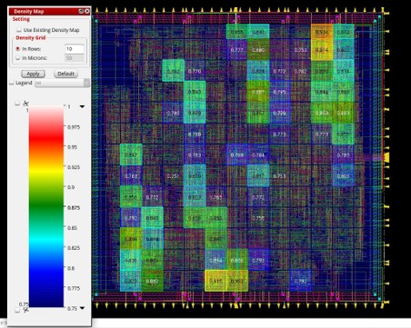

### Clock Tree Synthesis

  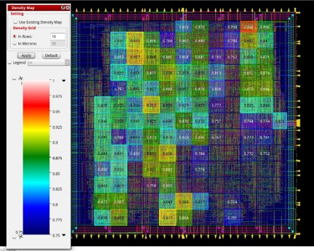

### Clock Tree Structure

  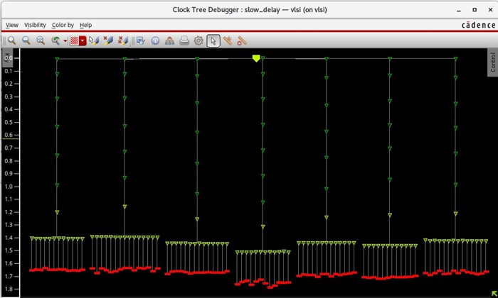

### Routing

  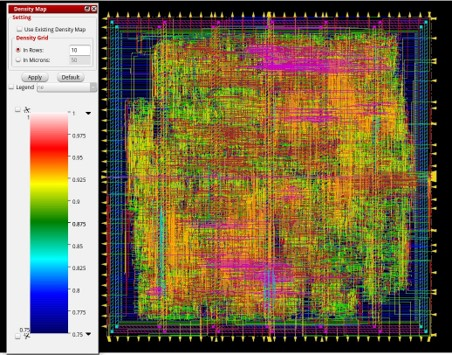

  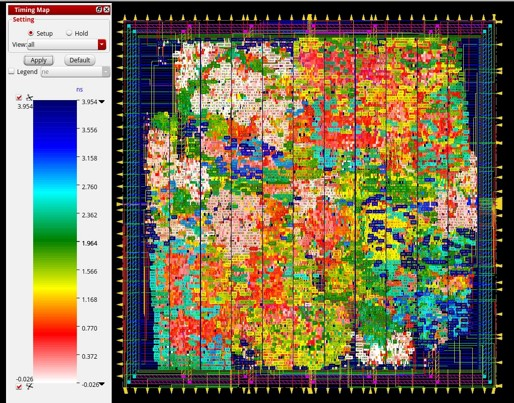

  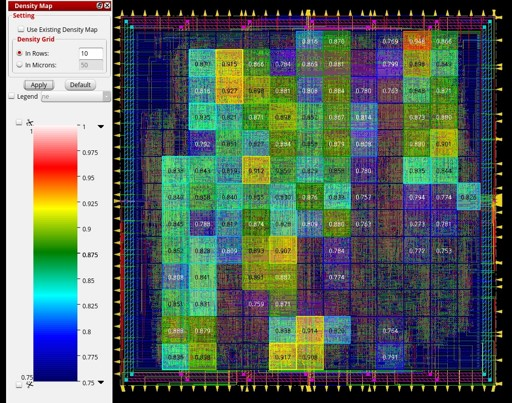

### Static Timing Analysis

  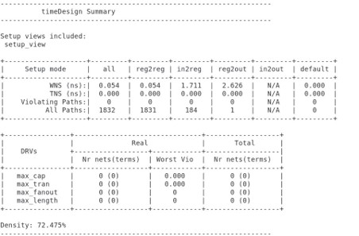

  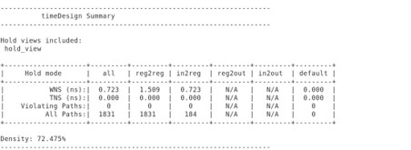

  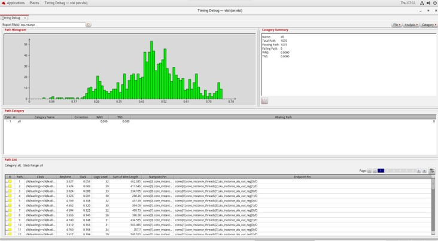

### Metal Stack Visualization

  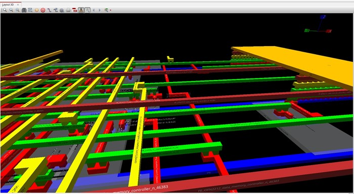

## Tools Used

* Cadence Genus
* Cadence Innovus
* Cadence Tempus
* Cadence Pegasus
* Cadence Conformal LEC

## Repository Structure

src/ — RTL source files

Constraints/ — Timing and design constraints

scripts/ — Automation scripts

netlist/ — Synthesized netlists

pnr/ — Physical design databases

reports/ — Implementation reports

make_flow*/ — Automated ASIC implementation flow

docs/images/ — Figures used in documentation

## Signoff Results

The design successfully completed the complete RTL-to-GDSII implementation flow and achieved:

* Positive setup timing slack
* Positive hold timing slack
* Zero DRC violations
* Zero LVS violations
* Zero antenna violations
* Final signoff-clean GDSII generation

## Author

Siam Al Shafin

Islamic University of Technology (IUT), Dhaka

Implementation performed using the Cadence digital ASIC design flow.
